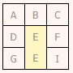
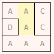

# Maze Solver 

## Maze Generator

For the generation of the maze, I chose Kruskal's algorithm as there was a lot of information about it on the Internet and it was fairly easy to implement.

Here is how it works: /the explanation is taken from [Kruskal's algorithm]([https://github.com/](https://weblog.jamisbuck.org/2011/1/3/maze-generation-kruskal-s-algorithm))/

Kruskal’s algorithm is a method for producing a minimal spanning tree from a weighted graph.
- Throw all of the edges in the graph into a set.
- Pull out the edge with the lowest weight (for the randomized version, it picks out a random edge). If the edge connects two trees that are not connected, join the trees. Otherwise, throw that edge away.
- Repeat until there are no more edges left.

Here is a walk-through of the process:

In this 3x3 grid, there is a different letter in every cell, indicating that they are from different sets.

The algorithm is straightforward: simply select an edge at random, and join the cells it connects if a path does not already connect them. We can know if the cells are already connected if they are in the same set. So, let’s choose the edge between (2,2) and (2,3). The cells are in different sets, so we join the two into a single set and connect the cells:

A few more passes of the algorithm.

 

Note what happens when the edge between (2,1) and (2,2) is pulled from the bag.

The two trees, A and E, were joined into one set, A, implying that any cell in A is reachable from any other cell in A. Let’s try joining (1,2) and (1,3) now.

Now, consider the edges (1,1)–(1,2) and (1,2)–(2,2). Neither of these has been drawn from the bag yet. What would happen if one of them were? Well, in both cases, the cells on either side of the edge belong to the same set. Connecting the cells in either case would result in a cycle, so we discard the edge and try again.

After one more pass of the algorithm, we will have a finished maze.

